# Comparativas visuales

## Diagrama de evolución

```mermaid
graph LR
    A["01<br/>Sin interfaz"] --> B["02<br/>Con interfaz"]
    B --> C["03<br/>Clase anónima"]
    C --> D["04<br/>Invocador"]
    D --> E["05<br/>Lambda"]
    E --> F["06<br/>Method References"]
    F --> G["07<br/>Streams"]
    G --> H["08<br/>Functional Interfaces"]
    H --> I["09<br/>Rendimiento"]

    style A fill:#d9534f,color:#fff
    style B fill:#e87722,color:#fff
    style C fill:#f0ad4e,color:#fff
    style D fill:#5cb85c,color:#fff
    style E fill:#5bc0de,color:#fff
    style F fill:#337ab7,color:#fff
    style G fill:#337ab7,color:#fff
    style H fill:#337ab7,color:#fff
    style I fill:#5cb85c,color:#fff
```



---

## Tabla comparativa — Etapas 01 a 05

| Criterio | 01 Sin interfaz | 02 Con interfaz | 03 Clase anónima | 04 Invocador | 05 Lambda |
|----------|:-:|:-:|:-:|:-:|:-:|
| Archivo `.java` separado | ✅ | ✅ | ❌ | ❌ | ❌ |
| Contrato común (`interface`) | ❌ | ✅ | ✅ | ✅ | ✅ |
| Nombre de método consistente | ❌ | ✅ | ✅ | ✅ | ✅ |
| Polimorfismo por referencia genérica | ❌ | ✅ | ✅ | ✅ | ✅ |
| Comportamiento como parámetro | ❌ | ❌ | ❌ | ✅ | ✅ |
| Sin clase auxiliar en bytecode | ✅ | ✅ | ❌ | ❌ | ✅ |
| Líneas para nueva operación (aprox.) | ~8 | ~8 | ~6 | ~6 | 1-3 |
| Legibilidad (subjetiva) | Media | Alta | Media | Alta | Muy alta |

---

## Tabla comparativa — Etapas 06 a 08 (requieren Java 8+)

| Característica | 06 Method Refs | 07 Streams | 08 Func. Interfaces |
|----------------|:-:|:-:|:-:|
| Requiere interfaz funcional | ✅ | ✅ | ✅ |
| Reutiliza métodos existentes | ✅ | Parcial | Parcial |
| Procesamiento de colecciones | ❌ | ✅ | ❌ |
| Composición de funciones | ❌ | ✅ | ✅ |
| Paralelismo sencillo | ❌ | ✅ | ❌ |
| Código sin interface propia | ✅ | ✅ | ✅ |

---

## Comparativa de sintaxis para la misma operación (suma)

```java
// Etapa 01 — clase concreta sin interfaz
new AdderNoInterface().add(6, 3);

// Etapa 02 — clase concreta con interfaz
new Adder().doOperation(6, 3);

// Etapa 03 — clase anónima
new ArithmeticCalculator() {
    public int doOperation(int a, int b) { return a + b; }
}.doOperation(6, 3);

// Etapa 04 — invocador con clase concreta
OperationInvoker.invoke(6, 3, new Adder());

// Etapa 05 — lambda
OperationInvoker.invoke(6, 3, (a, b) -> a + b);

// Etapa 06 — referencia a método estático
OperationInvoker.invoke(6, 3, Integer::sum);

// Etapa 07 — stream reduce
List.of(6, 3).stream().reduce(0, Integer::sum);

// Etapa 08 — BinaryOperator estándar
BinaryOperator<Integer> suma = Integer::sum;
suma.apply(6, 3);
```

---

[← Inicio](index) · [Ejercicios →](ejercicios/)
